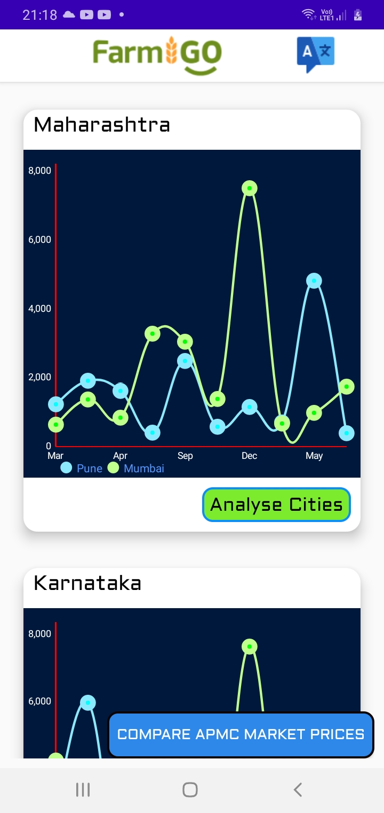
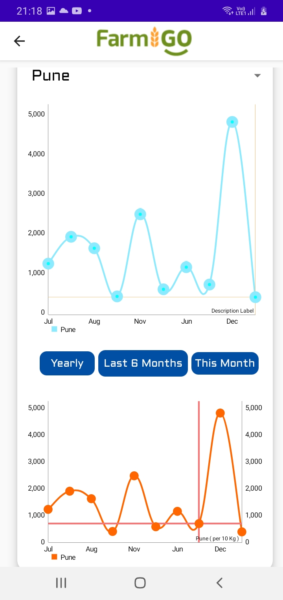
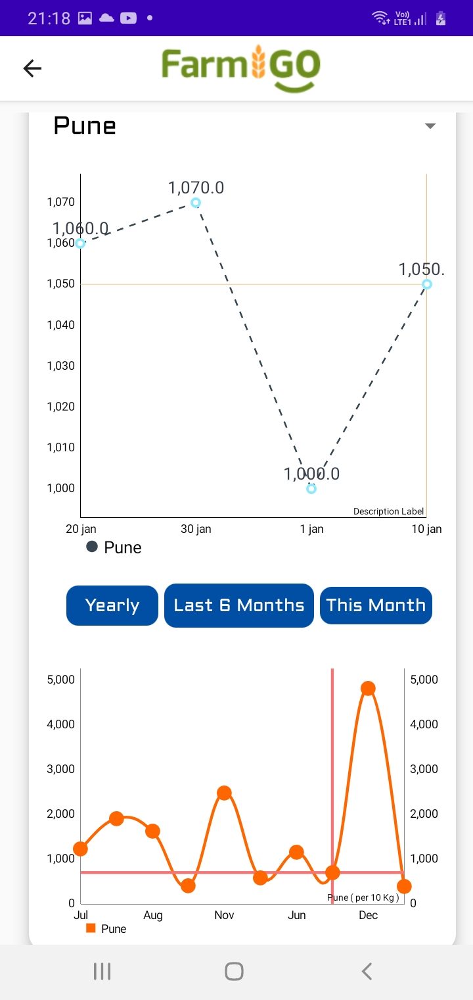
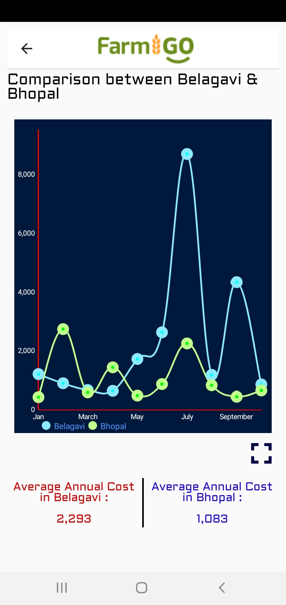

# The-Chart-App
## Use of MPAndroidChart Library to show beautiful line charts and comparison line charts.

# Features 
* Use of MPAndroidChat open-source library for beautiful line charts,
* Multilanguage (Hindi and English) support in app,
* Ability to compare between various and multiple data by selecting your prefrence in popup. 

    

